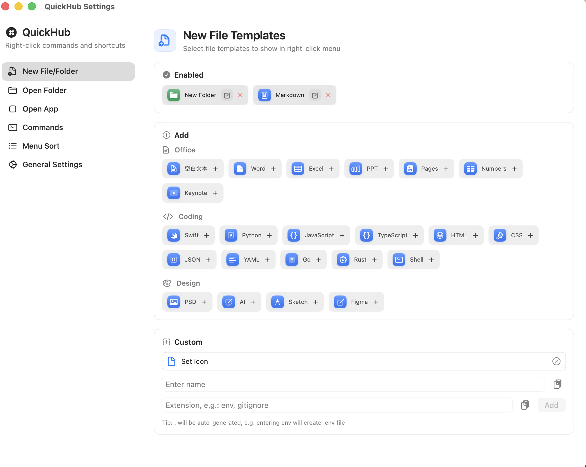
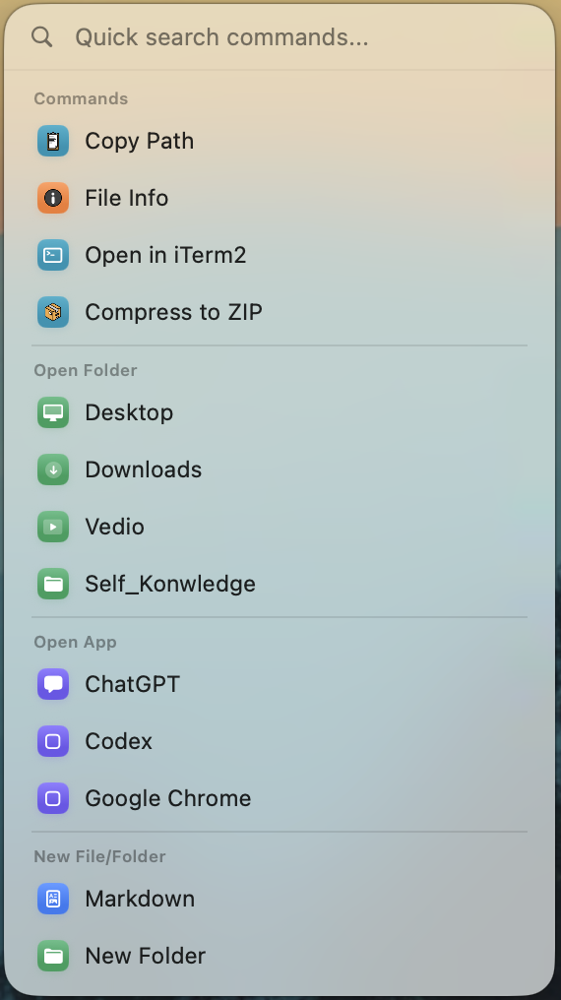
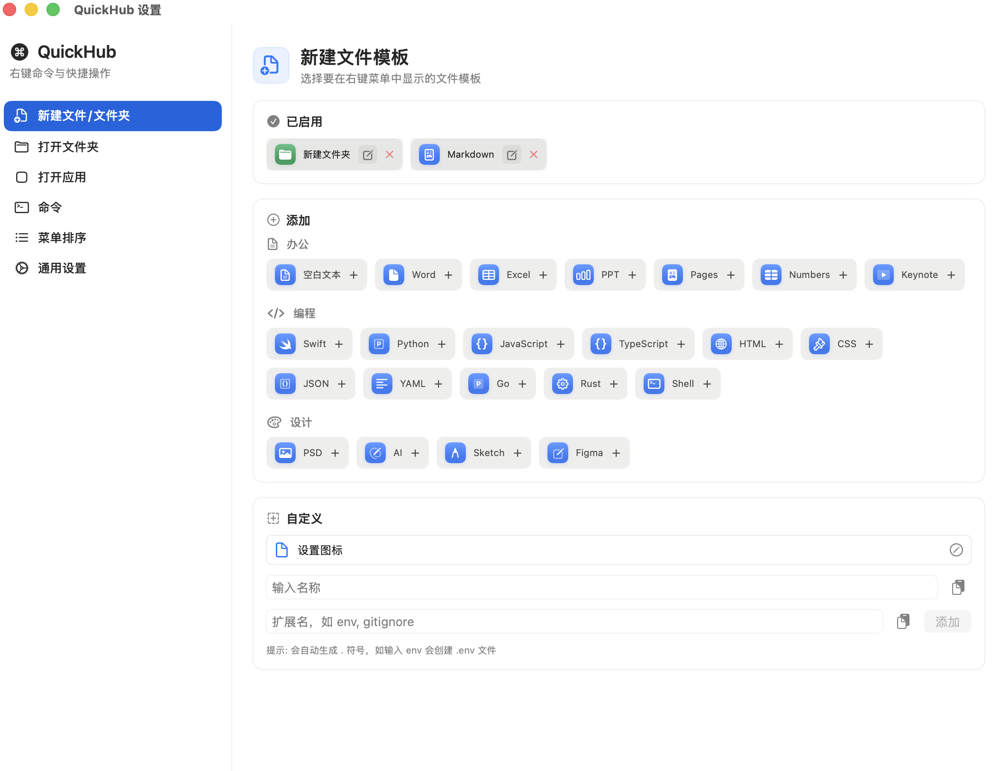
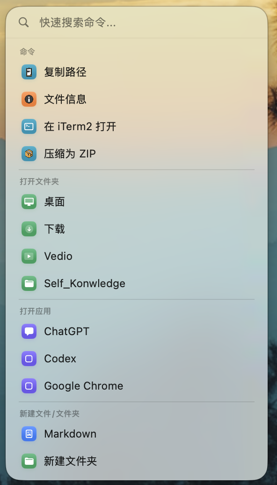

# QuickHub

[English](#english) | [中文](#中文)

---

## English

Minimal, fast macOS super toolbox. One key press gives your Finder infinite possibilities.

<p align="center">
  
  
</p>

### Download & Install

#### Direct Download (Recommended)
Download the packaged app: https://github.com/GobiCowboy/quickhub/releases/latest

1. Download `QuickHub-arm64.zip`
2. Extract and drag to **Applications** folder
3. On first run, right-click and select "Open"

#### Build from Source

```bash
xcodegen generate
xcodebuild -scheme RightClickX build
```

### Core Features

- **🛠️ Customize Your Toolbox**: Freely add actions like creating files, opening apps, opening directories, and running shell commands — with custom icons and names.
- **🚀 Multiple Ways to Launch**: Press Option + Q or right-click in Finder to open the panel. Both triggers are always in sync.
- **🔧 Configurable Default Action**: Choose whether right-click opens the QuickHub panel or the system native menu — your choice in Settings.
- **⌥ Native Menu on Demand**: Hold Option + Right-click to show the system native context menu directly.
- **⌨️ Search and Go**: Type to search commands right after the panel appears, press Enter to execute instantly.
- **🔄 Built-in Update**: Check for updates in Settings → About. Downloads, installs, and restarts automatically.

### Quick Start

1. **Run the app**: QuickHub icon appears in menu bar.
2. **Settings**: Click the gear icon to customize your tools.

### Why QuickHub?

1. **Better than Context Menu**: No more messy secondary/tertiary context menus. Search + Enter solves everything.
2. **More Precise than Spotlight**: You only search the tools you need, no system noise.
3. **Extremely Lightweight**: Barely uses system resources, only appears when needed.

### System Requirements

- macOS 13.0 (Ventura) or later

### Language Support

QuickHub supports **English** and **Chinese**. You can switch languages in **Settings → General → Language**.

---

## 中文

极简、极速的 macOS 超级工具箱。通过一个按键，赋予你的 Finder 无限可能。

<p align="center">
  
  
</p>

### 下载安装

#### 直接下载（推荐）
下载打包好的应用：https://github.com/GobiCowboy/quickhub/releases/latest

1. 下载 `QuickHub-arm64.zip`
2. 解压后拖到 **应用程序** 文件夹
3. 首次运行需要右键点击选择"打开"

#### 从源码编译

```bash
xcodegen generate
xcodebuild -scheme RightClickX build
```

### 核心特性

- **🛠️ 自定义你的工具箱**: 自由添加新建文件、打开常用应用、打开常用目录、Shell 命令等操作，支持自定义图标和名称。
- **🚀 多种呼出方式**: Option + Q 或鼠标右键呼出面板，两种方式同步可用。
- **🔧 右键默认行为可配置**: 在设置中选择右键默认打开 QuickHub 面板或系统原生菜单。
- **⌥ 原生菜单随时可用**: 按住 Option + 右键 可直接显示系统原生右键菜单。
- **⌨️ 即搜即用**: 呼出面板后直接打字搜索命令，按回车立即执行。
- **🔄 应用内更新**: 在 设置 → 关于 中检查更新，自动下载、安装并重启。

### 快速开始

1. **运行应用**: 菜单栏会出现 QuickHub 图标。
2. **设置**: 点击齿轮图标进入设置，自定义你的工具箱。

### 为什么选择 QuickHub？

1. **比起右键菜单更爽**: 告别杂乱的二级、三级右键菜单，用搜索和回车解决一切。
2. **比起聚焦搜索更准**: 你只搜索你需要的工具，没有系统杂音。
3. **极其轻量**: 几乎不占系统资源，仅在需要时现身。

### 系统要求

- macOS 13.0 (Ventura) 或更高版本

### 语言支持

QuickHub 支持 **英文** 和 **中文**。你可以在 **设置 → 通用 → 语言** 中切换语言。

---

感谢你的支持！如果有任何建议，欢迎提交反馈。
